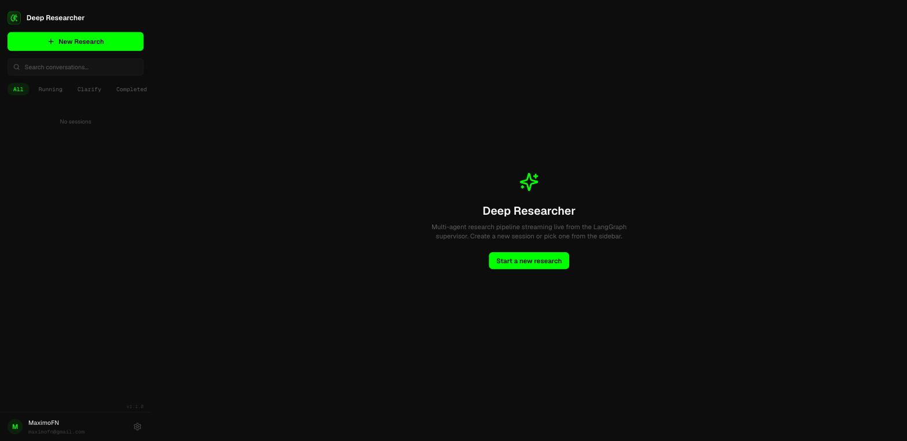
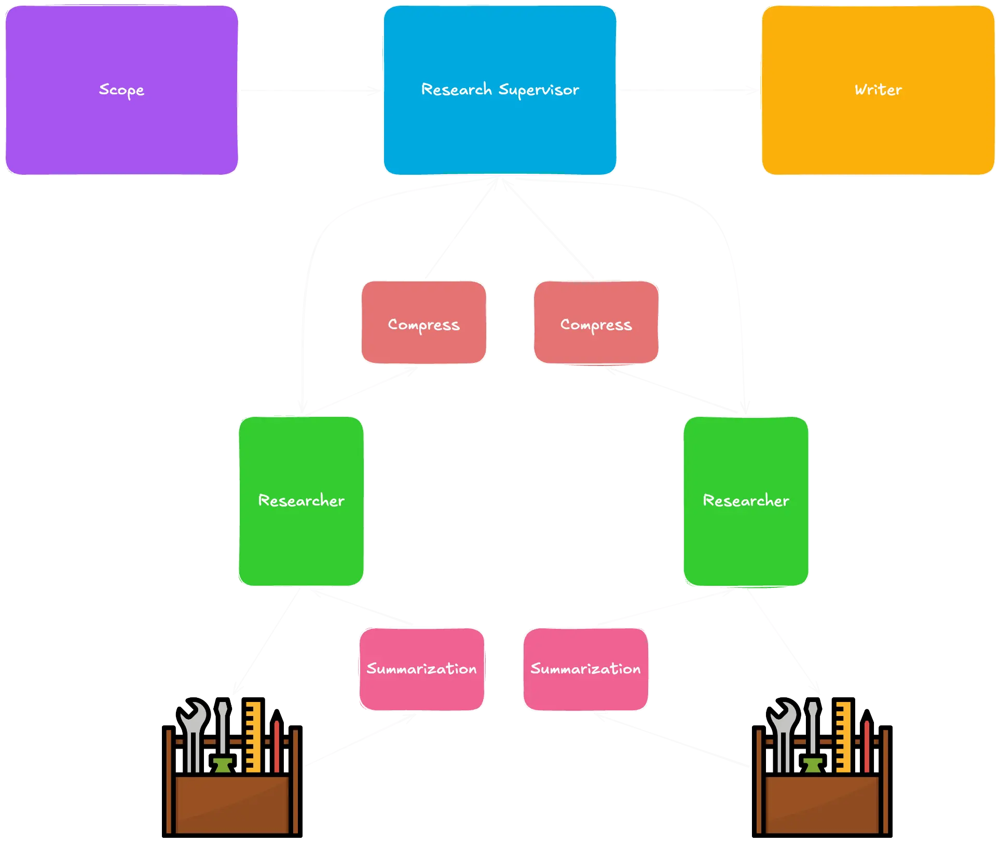
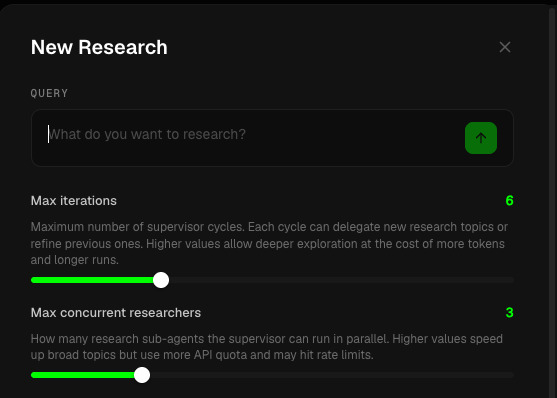

<div align="center">

# 🔍 LangGraph Deep Researcher

**A multi-agent research system that plans, searches, compresses and writes, so you don't have to.**

A supervisor agent breaks your question into topics, launches research sub-agents in parallel,
compresses their findings and hands everything to a writer agent that produces a sourced markdown report.

### [**▶ Try the live demo, deepresearcher.maximofn.com**](https://deepresearcher.maximofn.com/)

[](https://deepresearcher.maximofn.com/)
[](https://github.com/langchain-ai/langgraph)
[](https://www.python.org/)
[](https://fastapi.tiangolo.com/)
[](https://react.dev/)
[](LICENSE)



</div>

---

## Why this exists

A single LLM call with a web-search tool gives you a shallow answer. Real research needs *decomposition*
(what should I even look up?), *parallelism* (five topics at once, not one after another) and
*context hygiene* (don't drown the writer in 200 raw search results).

This project implements that as an explicit LangGraph state machine, with each concern isolated in its own
agent and its own context window:

| | |
|---|---|
| 🧭 **Scope** | Asks clarifying questions when your request is ambiguous, then turns the conversation into a structured research brief. |
| 🧠 **Supervisor** | Splits the brief into topics and delegates them to sub-agents, up to `max_concurrent_researchers` in parallel, over `max_iterations` cycles. |
| 🔬 **Researchers** | Iterative Tavily web search (or your local filesystem via MCP) with a `think_tool` for strategic planning between searches. |
| 🗜️ **Compress** | Each sub-agent's raw notes are compressed before they ever reach the supervisor, keeping context lean. |
| ✍️ **Writer** | Synthesizes every compressed finding into a final markdown report, and stays available for follow-up questions afterwards. |

<div align="center">

</div>

## Features

- **🔀 Parallel research**, `asyncio.gather()` fans out sub-agents; the supervisor aggregates their compressed notes.
- **💬 Clarification loop**, the scope agent asks before it guesses, so the brief actually matches your intent.
- **📡 Live streaming**, every agent thought, tool call and search result streams to the UI over WebSockets while the research runs.
- **🗣️ Post-research chat**, once the report is ready, keep asking questions; the writer answers with the full research context (notes + brief + report) loaded from the LangGraph checkpoint.
- **🔑 Bring your own keys**, API keys are stored in your browser, sent over HTTPS per request and never persisted server-side.
- **🎛️ Per-role model picking**, assign a different model to each agent role (scope, supervisor, research, compress, summarization, writer) from the UI.
- **📬 Email delivery**, optionally get the finished report in your inbox.
- **🛠️ MCP support**, swap web search for local filesystem research via Model Context Protocol.
- **💾 Persistence**, sessions, messages and events stored in SQLite; reload any past investigation.

<div align="center">

</div>

## Quick start

### 1. Just use the demo

👉 **[deepresearcher.maximofn.com](https://deepresearcher.maximofn.com/)**, add your own API keys in *Preferences* and start researching. Nothing to install.

### 2. Run it locally

```bash
git clone https://github.com/maximofn/langgraph_deepresearcher.git
cd langgraph_deepresearcher

uv sync                                # install dependencies
cp .env.example .env                   # add your API keys

# Backend, API on http://localhost:8000
docker compose up --build -d

# Frontend, UI on http://localhost:5173
cd web && npm install && npm run dev
```

### 3. Or run the CLI

```bash
source .venv/bin/activate
python src/langgraph_deepresearch.py
```

## Configuration

Create a `.env` with the providers you plan to use, you only need keys for the models you actually assign:

```bash
OPENAI_API_KEY=        # GPT-4.1 / GPT-5 family
ANTHROPIC_API_KEY=     # Claude Sonnet 4.5
GEMINI_API_KEY=        # Gemini 3 Pro
KIMI_K2_API_KEY=       # Moonshot Kimi K2 Thinking
CEREBRAS_API_KEY=      # Qwen 3 Coder 480B
GITHUB_API_KEY=        # GitHub Models
TAVILY_API_KEY=        # web search  (required)
LANGSMITH_API_KEY=     # tracing & evaluation (optional)
RESEND_API_KEY=        # email delivery (optional)
```

Default role → model assignments live in [`src/LLM_models/model_catalog.py`](src/LLM_models/model_catalog.py):

| Role | Default model | Why |
|---|---|---|
| `scope` | GPT-4.1 | Structured output for clarify / brief decisions |
| `supervisor` | Claude Sonnet 4.5 | Tool-calling and delegation |
| `research` | Claude Sonnet 4.5 | Iterative search with tool use |
| `compress` | GPT-4.1 | 32K-token summarization |
| `summarization` | GPT-4.1 Mini | Cheap per-result summaries |
| `writer` | GPT-4.1 | 32K-token final report |

All of them are overridable per session from the UI.

## Project layout

```
src/
  scope/          # clarification + research brief
  supervisor/     # topic decomposition + delegation
  research/       # Tavily-based research agent
  research_mcp/   # MCP filesystem research agent
  write/          # final report + post-research chat
  LLM_models/     # model catalog and per-role config
api/              # FastAPI: REST, WebSockets, SQLite persistence
web/              # React 18 + TypeScript + Tailwind + zustand
test/             # agent evals (LangSmith) + API tests
```

## API

The backend exposes a small REST surface plus a WebSocket channel per session:

| Method | Endpoint | Purpose |
|---|---|---|
| `POST` | `/sessions/` | Create a session |
| `POST` | `/sessions/{id}/start` | Start the research run |
| `POST` | `/sessions/{id}/clarify` | Answer the scope agent's question |
| `POST` | `/sessions/{id}/chat` | Ask a follow-up once the report is done |
| `GET` | `/sessions/{id}/messages` | Replay stored events |
| `GET` | `/models/` | Model catalog |
| `WS` | `/ws/sessions/{id}` | Live event stream |

Full details in [API_README.md](API_README.md).

## Tests

```bash
python test/test_agent_scope.py       # LangSmith eval: clarification decisions
python test/test_agent_research.py    # LangSmith eval: continue vs. stop research
pytest test/api/                      # FastAPI integration tests
```

## Deployment

- **Backend** → [Fly.io](https://fly.io) (`fly.toml`, region `cdg`, SQLite on a mounted volume, auto-stop when idle)
- **Frontend** → Cloudflare Pages (auto-deploys on push to `main`)

## Built with

[LangGraph](https://github.com/langchain-ai/langgraph) · [LangChain](https://github.com/langchain-ai/langchain) · [Tavily](https://tavily.com) · [FastAPI](https://fastapi.tiangolo.com) · [React](https://react.dev) · [TailwindCSS](https://tailwindcss.com) · [Model Context Protocol](https://modelcontextprotocol.io)

Inspired by LangChain's [*Deep Research from Scratch*](https://github.com/langchain-ai/deep_research_from_scratch) course.

## License

[Apache 2.0](LICENSE), by [MaximoFN](https://github.com/maximofn)

---

<div align="center">

⭐ **If you find this useful, consider starring the repo** ⭐

</div>
